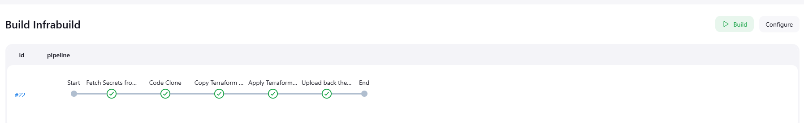
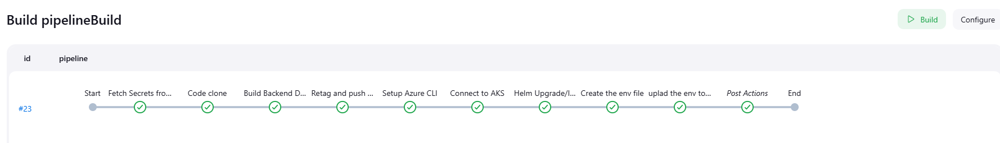

# Multi-Cloud CI/CD Pipeline Implementation
## Project Overview
This project demonstrates a scalable Continuous Integration and Continuous Deployment (CI/CD) pipeline designed for multi-cloud environments, addressing the challenges of deploying applications across different cloud platforms with consistency, security, and efficiency.

## Context
- [Problem Statement](#problem-statement)
- [Project Goals](#project-goals)
- [Architecture](#architecture)
- [Technologies and Tools](#technologies-and-tools)
- [Docker Containers](#docker-containers)
- [Deployment Strategy](#deployment-strategy)
- [Jenkins Pipeline](#jenkins-pipelines)
- [Prerequisites](#prerequisites)
- [Getting Started](#getting-started)
- [Output](#output)
- [Security Considerations](#security-considerations)
- [Presentation](#presentaion)
- [Future Improvements](#future-improvements)


## Problem Statement
Organizations are increasingly adopting multi-cloud strategies to:

- Avoid vendor lock-in
- Improve application resilience
- Leverage best-in-class services from different cloud providers

The primary challenge is implementing a CI/CD pipeline that can seamlessly deploy applications across multiple cloud environments while maintaining performance and security.
## Project Goals

- Design a flexible CI/CD pipeline supporting deployments to multiple cloud platforms (AWS, Azure, GCP)
- Ensure secure and efficient management of credentials and secrets
- Optimize pipeline performance to reduce deployment times and operational overhead

## Architecture
### Repository Structure
```bash
SlabAI
├── InfraDeployement
│   ├── aws
│   │   ├── main.tf
│   │   ├── modules
│   │   │   ├── cloudFront
│   │   │   │   ├── main.tf
│   │   │   │   └── variable.tf
│   │   │   └── s3
│   │   │       ├── main.tf
│   │   │       └── variable.tf
│   │   ├── output.tf
│   │   └── varibale.tf
│   ├── azure
│   │   ├── main.tf
│   │   ├── modules
│   │   │   └── aks_cluster
│   │   │       ├── main.tf
│   │   │       └── variable.tf
│   │   └── output.tf
│   ├── main.tf
│   ├── output.tf
│   ├── terraform.tfstate
│   └── variable.tf
├── Infrabuildpipeline.jenkinsfile
├── README.md
├── backend
│   ├── paymentService
│   │   └── Dockerfile
│   ├── projectService
│   │   └── Dockerfile
│   └── userService
│       └── Dockerfile
├── docker-compose.yml
├── frontend
│   ├── Dockerfile
│   └── template
├── pipelinedeployment.jenkinsfile
├── slabai
│   ├── Chart.yaml
│   ├── templates
│   │   ├── _helpers.tpl
│   │   ├── configMap.yaml
│   │   ├── dependent-deployment.yaml
│   │   ├── payment-deployment.yaml
│   │   ├── persistanceVolume.yaml
│   │   ├── project-deployment.yaml
│   │   ├── service.yaml
│   │   └── user-deployment.yaml
│   └── values.yaml
└── test
```

.png)
## Technologies and Tools
| Category                | Tools                                 |
|-------------------------|---------------------------------------|
| CI/CD Orchestration     | Jenkins                              |
| Infrastructure as Code  | Terraform, Pulumi                    |
| Container Orchestration | Kubernetes                           |
| Secrets Management      | HashiCorp Vault                      |
| Containerization        | Docker                               |
| Cloud Providers         | AWS, Azure, GCP                      |

## Docker Containers
Backend services are containerized and pushed to Docker Hub:

- Payment Service
- Project Service
- User Service

## Deployment Strategy

1. Infrastructure Deployment

    - Terraform modules for cloud infrastructure provisioning
    - Supports multiple cloud providers (AWS, Azure)
    - Configures:

        - S3 buckets
        - S3 static website hosting
        - CloudFront distributions
        - Azure Kubernetes Service (AKS)


2. Application Deployment

    - Helm charts for Kubernetes deployments
    - Consistent deployment across cloud environments
    - Supports microservices architecture
    - Can set the enviroment variable on run


3. Secret Management

    - HashiCorp Vault for secure credential handling
    - Centralized secret management across cloud platforms


## Jenkins Pipelines
#### Infrastructure Pipeline (infrastructure.jenkinsfile)

- Handles cloud infrastructure provisioning
- Manages Terraform state
- Configures cloud resources



#### Deployment Pipeline (deployment.jenkinsfile)

- Manages application deployment
- Handles containerized service deployments
- Integrates with Kubernetes and Helm



## Prerequisites

- Docker
- Kubernetes
- Terraform
- Jenkins
- HashiCorp Vault
- Cloud Provider CLI (AWS, Azure)

## Getting Started

1. Clone the repository
2. Set up HashiCorp Vault
3. Configure cloud provider credentials in Vault
4. Deploy infrastructure using Jenkins
5. Deploy applications using Deployment Pipeline

## Output


## Security Considerations

- Secrets managed through HashiCorp Vault
- Least privilege access principles
- Encrypted communication between services
- Regular credential rotation

## Presentaion

[SlabAI PPT presentation](https://docs.google.com/presentation/d/1TXBne5SAkOhQXtBRc9S2yBBXNMbrdp2XuCiP3BjtJzc/edit?usp=sharing)

## Future Improvements

- Multi-region deployment strategies
- Enhanced automated testing
- Advanced canary and blue-green deployment techniques
- Improved monitoring and alerting